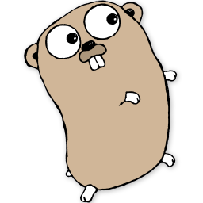

# 理解Linux进程

## 关于这本书

本书受[*理解Unix进程*](http://www.duokan.com/book/41446)启发而作，用极简的篇幅深入学习进程知识。

*理解Linux进程*用Go重写了所有示例程序，通过循序渐进的方法介绍Linux进程的工作原理和一切你所需要知道的概念。

本书适合所有Linux程序员阅读。[在线阅读](https://tobegit3hub1.gitbooks.io/understanding-linux-processes/content/)，[PDF下载](https://www.gitbook.com/download/pdf/book/tobegit3hub1/understanding-linux-processes)。

## 三位好朋友

阅读前介绍三位即将与大家打交道的小伙伴：Linux、Go和Docker。

Linux是我们主要的研究对象，书中所有概念与程序都基于Linux，这同样适用于所有Unix-like系统。

Go是本书所有示例程序的实现语言，当然进程的概念与原理是相通的，你也可以使用其他编程语言实现。

Docker为我们创造可重复的实验环境，使用Docker容器你可以轻易地模拟与本书一模一样的运行环境。
