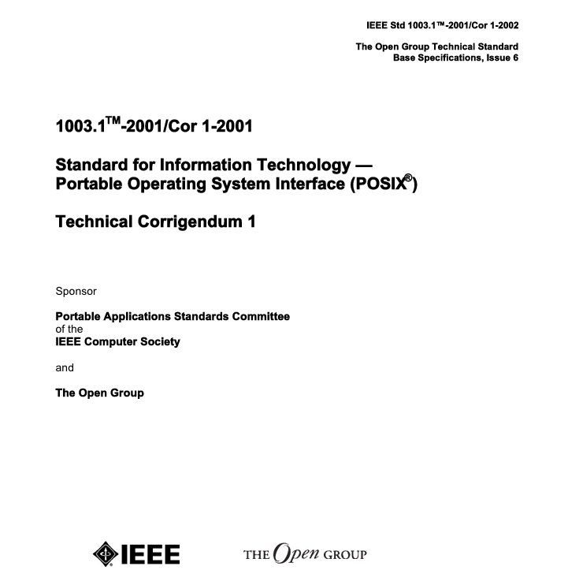

## POSIX简介

POSIX(Portable Operation System Interface)听起来好高端，就是一种操作系统的接口标准，至于谁遵循这个标准呢？就是大名鼎鼎的Unix和Linux了，有人问Mac OS是否兼容POSIX呢，答案是Yes苹果的操作系统也是Unix-based的。

有了这个规范，你就可以调用通用的API了，Linux提供的POSIX系统调用在Unix上也能执行，因此学习Linux的底层接口最好就是理解POSIX标准。

补充一句，目前很多编程语言(Go、Java、Python、Ruby等)都是天生跨平台的，因此我们很少注意系统调用的兼容性。实际上POSIX提供了这些语言上跨平台的语义，而且这是源码级别的保证。

## POSIX规范

POSIX是一些IEEE标准，包括1003.0、1003.1、1003.1b和2003等，实际上连Linux也没有完全兼容这些定义，不过只用Linux来学习POSIX足够了。

鉴于绝大多数程序员都没看过IEEE文档，我们就翻一下[IEEE 1003.1-2001](http://wenku.baidu.com/link?url=8dfQAy-mpeNdkDzX1LWCCEJia5x4_pS-Br6alnnrNweN8HxyXbHewGnxrPgFhQ3TzaAodlfHay9KiAuOmKbWvfSUr-36XyFIDgokfCldgR7)吧。

篇幅跟论文差不多，大意就是修正Base标准存在的问题，这个文档没有增加新的接口，但是加了符号、非函数的定义和保留更多命名空间。这是非常严谨的文档，感兴趣的同学可以读下，对普通的程序员我们还是建议了解以下的内容。

## POSIX进程

我们运行Hello World程序时，操作系统通过POSIX定义的`fork`和`exec`接口创建起一个POSIX进程，这个进程就可以使用通用的IPC、信号等机制。

## POSIX线程

POSIX也定义了线程的标准，包括创建和控制线程的API，在Pthreads库中实现，有关线程的知识有机会再深入学习。
